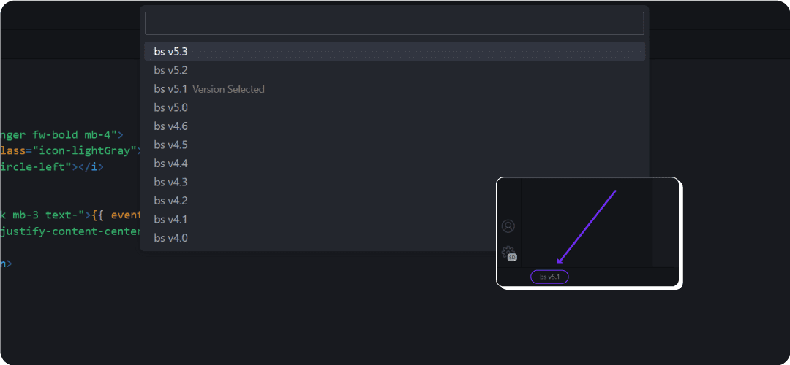

# Bootstrap Autocomplete

Bootstrap Autocomplete is a Visual Studio Code extension that enhances the development experience with Bootstrap. It offers CSS class autocompletion, reducing errors and saving time for developers. This tool simplifies working with Bootstrap, making the development process more efficient and effective.

This extension is a fork of the no longer maintained [Bootstrap IntelliSense](https://github.com/hossaini310/bootstrap-intellisense) extension. It has been updated to support the latest versions of Bootstrap and to provide a better development experience for users. The extension is open source and welcomes contributions from the community.

## Installation

**[Install via the Visual Studio Code Marketplace →](https://marketplace.visualstudio.com/items?itemName=MrMarble.bootstrap-autocomplete)**

In order for the extension to activate you must have Bootstrap installed in your workspace.

## Activation

The extension will be activated automatically when it's installed. If it's not activated, you can manually activate it using the command `Bootstrap IntelliSense: Enable` with `ctrl + shift + p`.

## Features

### CSS Class Autocomplete

Bootstrap Autocomplete is a Visual Studio Code extension that offers CSS class autocomplete for Bootstrap. Enter a class name and the extension will suggest matching CSS classes, if not than try `ctrl + space` to trigger the autocomplete.

<!-- add img -->

#### suported versions:

## Contributing

Contributions are welcome! If you would like to add new features or make improvements to the project, feel free to fork the repository and submit your changes via pull requests. Your contributions will be highly appreciated and will help make the project even better. Thank you in advance for your interest in contributing!

## Requirements

This extension requires VSCode version 1.67.1 or higher.

Enjoy!
